# Account Management System
       A desktop application made with Python/Kivy for managing account related data for college students'.

#### Homescreen
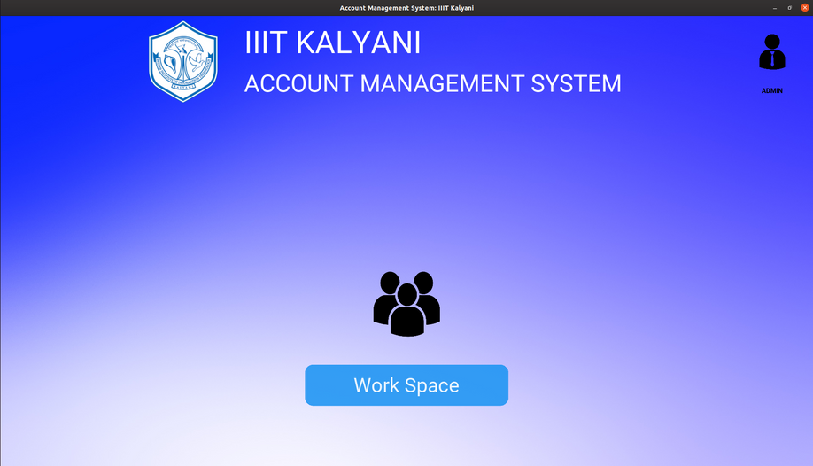

#### Dependencies for this project:
* Python3
* Kivy
* KivyMD
* xlrd
* fpdf
* pygame

Instructions to run this app:
---------------------------------------------
* Clone this repository: `git clone https://github.com/shashi278/AC_Management.git`
* Install requirements(Depending upon what you call it, pip/pip3): `cd AC_Management && pip3 install -r requirements.txt`
* Change current directory to `src` directory: `cd AC_Management/src`
* And run(Depending upon what you call it, python/python3): `python3 main.py`

##
#### Note:
If it's the first time you're trying to install *kivy* on *ubuntu*, you're likely to run into errors.
If your error looks like this

<pre>

/tmp/pip-install-yqca572t/kivy/kivy/include/gl_redirect.h:72:13: fatal error: GL/gl.h: No such file or directory
       72 | #   include &lt;GL/gl.h&gt;
          |             ^~~~~~~~~
    compilation terminated.
     error: command 'x86_64-linux-gnu-gcc' failed with exit status 1
     
 </pre>

Running `sudo apt install qt4-dev-tools` should work for you.(Why? 'cause it worked for me!)

If that doesn't work, try this:
`sudo apt-get install build-essential autoconf libtool pkg-config python3-opengl python3-pyside.qtopengl qt4-dev-tools qt4-designer libqtgui4 libqtcore4 libqt4-xml libqt4-test libqt4-script libqt4-network libqt4-dbus libgle3 python3-dev libssl-dev`

Screenshots:
===========
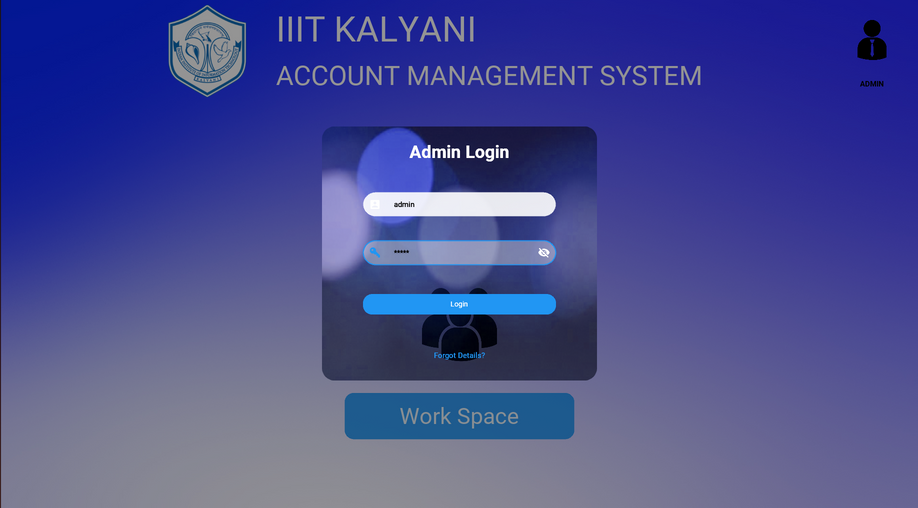
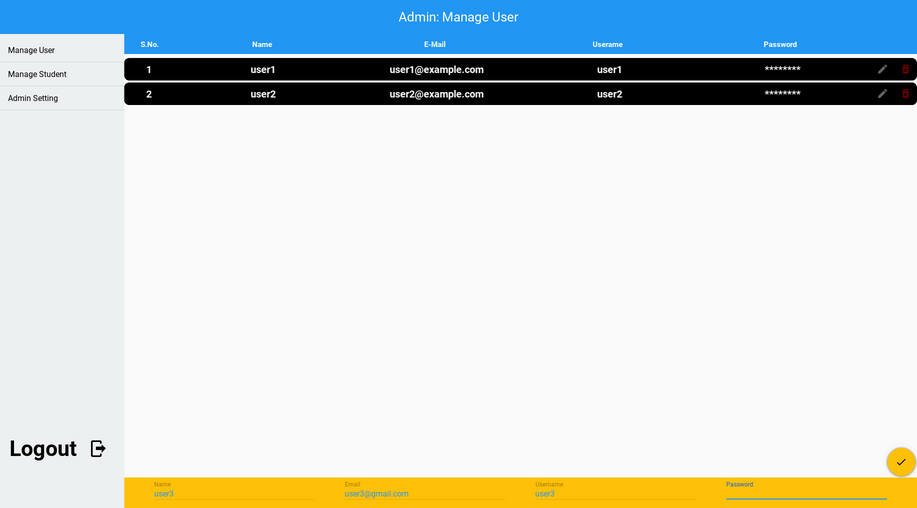
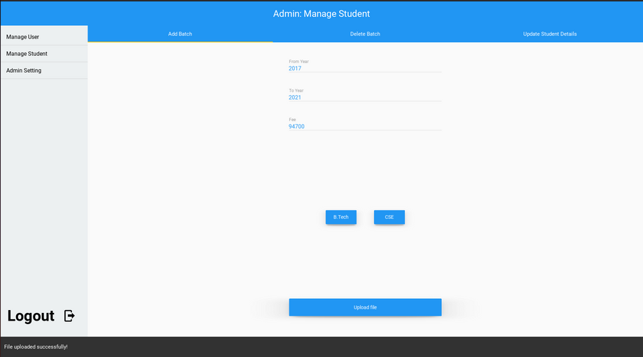
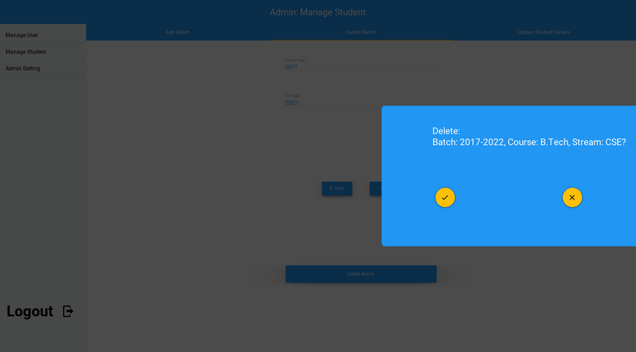
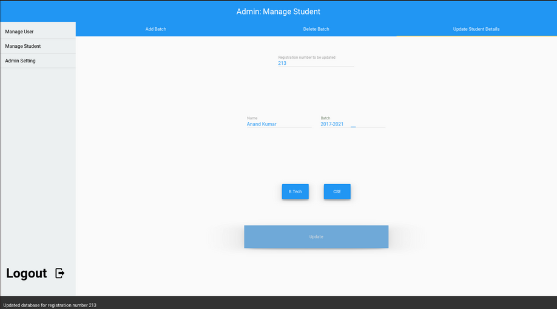
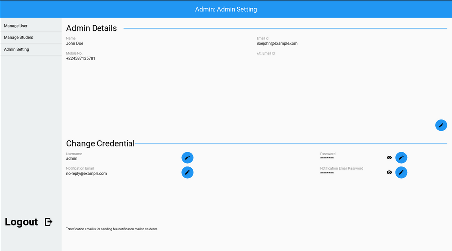
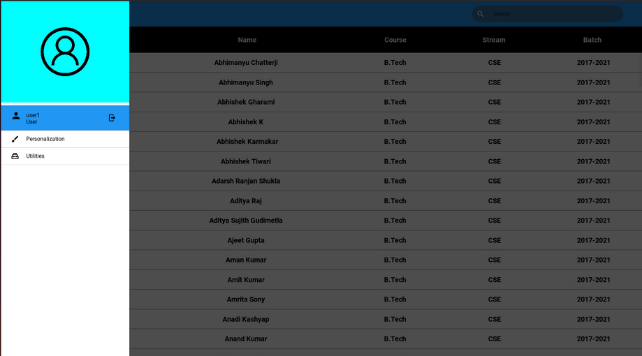
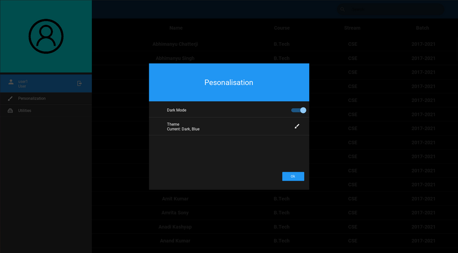
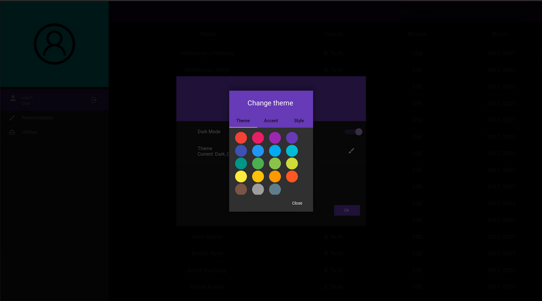

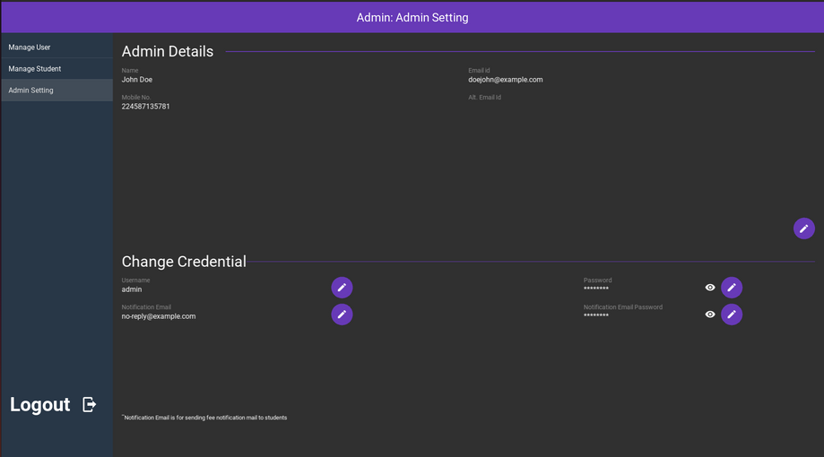
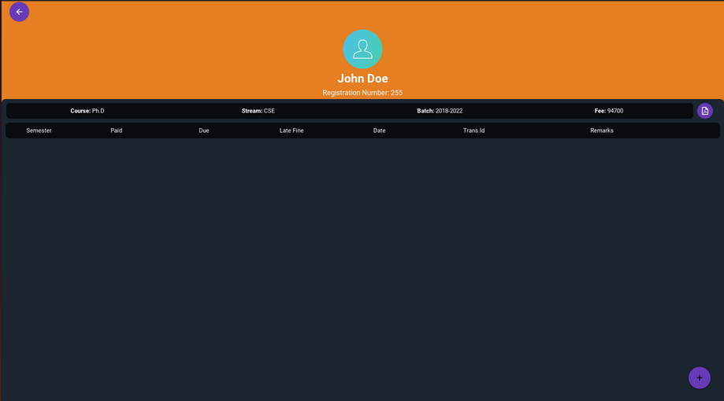
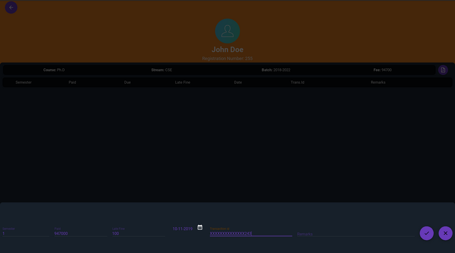
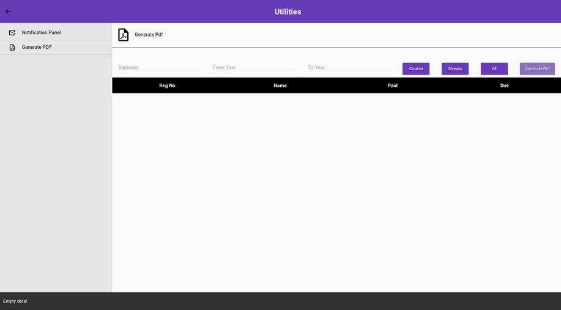
